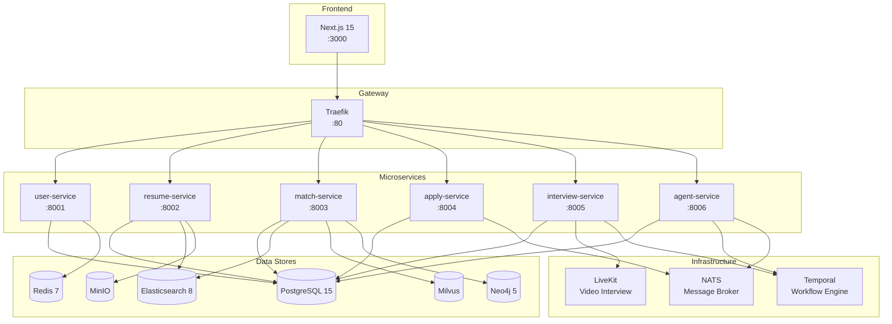

# JobPilot

AI-powered job matching and recruitment platform with microservices architecture.

[](https://github.com/jobpilot/jobpilot/actions/workflows/ci.yml)
[](https://github.com/jobpilot/jobpilot/actions/workflows/full-verification.yml)
[](https://www.python.org/)
[](https://nextjs.org/)
[]()

## Architecture



### Service Overview

| Service | Port | Key Features |
|---------|------|-------------|
| **Frontend** | 3000 | Next.js 15, TypeScript, Ant Design 5, Tailwind CSS |
| **user-service** | 8001 | Auth (JWT+bcrypt), Email Verification, Password Reset, Rate Limiting, Audit Logs |
| **resume-service** | 8002 | PDF/DOCX/Image OCR Parsing, AI Generation (LangChain), ATS Scoring (35 rules), Templates |
| **match-service** | 8003 | Elasticsearch Search, Vector Matching (sentence-transformers+Milvus), Job Comparison, Career Path (Neo4j), Salary Prediction (XGBoost) |
| **apply-service** | 8004 | Application Tracking (State Machine), Smart Form Filling, Chrome Extension, CRM Sync |
| **interview-service** | 8005 | LiveKit Rooms, AI Interviewer (LangChain+Claude), Speech Transcription, Multimodal Analysis, Question Bank |
| **agent-service** | 8006 | Temporal Workflows (DailyScan+Application Saga), Event Tracking (Kafka), Model Retraining (QLoRA), Prometheus Monitoring |

### Data Layer

| Store | Port | Purpose |
|-------|------|---------|
| PostgreSQL 15 | 5432 | Primary relational database for all services |
| Redis 7 | 6379 | Cache, session, rate limiting |
| Elasticsearch 8 | 9200 | Full-text job search (single-node) |
| Milvus Standalone | 19530 | Vector embeddings for semantic resume-job matching |
| Neo4j 5 Community | 7474/7687 | Skill-role relationship graph for career path planning |
| MinIO | 9000/9001 | Object storage for resumes, models, and data lake |

### Infrastructure

| Component | Port | Purpose |
|-----------|------|---------|
| Traefik v3 | 80/8080 | API Gateway & reverse proxy |
| LiveKit | 7880 | Real-time video interview (WebRTC SFU) |
| Temporal | 7233 | Workflow orchestration (Saga, retry, cron) |
| NATS | 4222 | Lightweight message broker for async events |

## Quick Start

```bash
cp .env.example .env
make setup
make up
make status
bash scripts/demo.sh
```

**Access Points:**
- Frontend: http://localhost:3000
- API (via Traefik): http://localhost/api
- Traefik Dashboard: http://localhost:8080
- MinIO Console: http://localhost:9001
- Neo4j Browser: http://localhost:7474

## API Documentation

Each service exposes interactive OpenAPI docs (Swagger UI):

| Service | Swagger UI | Curl Examples |
|---------|-----------|---------------|
| User Service | [localhost:8001/docs](http://localhost:8001/docs) | [API_EXAMPLES.md](backend/services/user_service/API_EXAMPLES.md) |
| Resume Service | [localhost:8002/docs](http://localhost:8002/docs) | `curl -X POST :8002/parse -F "file=@resume.pdf"` |
| Match Service | [localhost:8003/docs](http://localhost:8003/docs) | `curl ":8003/jobs/search?q=python"` |
| Apply Service | [localhost:8004/docs](http://localhost:8004/docs) | `curl -X POST :8004/ -d '{"job_id":"..."}'` |
| Interview Service | [localhost:8005/docs](http://localhost:8005/docs) | `curl -X POST :8005/start -d '{}'` |
| Agent Service | [localhost:8006/docs](http://localhost:8006/docs) | `curl -X POST :8006/workflows/application -d '{}'` |

See [API_EXAMPLES.md](backend/services/user_service/API_EXAMPLES.md) for detailed curl examples with request/response bodies.

## Development

See [CONTRIBUTING.md](CONTRIBUTING.md) for full setup instructions, code style, and testing guides.

```bash
# Backend
cd backend && pip install -e .
cd services/user_service && pytest tests/ -v

# Frontend
cd frontend && npm install && npm run dev
npx tsc --noEmit
npx prettier --write "src/**/*.{ts,tsx,css}"
```

### Testing

| Service | Test Files | Framework |
|---------|-----------|-----------|
| user-service | 6 files, ~25 tests | pytest + httpx |
| resume-service | 6 files, ~35 tests | pytest + httpx |
| match-service | 1 file, ~17 tests | pytest |
| apply-service | 1 file, ~19 tests | pytest |
| interview-service | 1 file, ~17 tests | pytest |
| agent-service | 1 file, ~10 tests | pytest |

## Kubernetes Deployment

```bash
helm upgrade --install jobpilot ./deploy/helm/jobpilot \
  --namespace jobpilot --create-namespace \
  --set global.domain=jobpilot.example.com

# Terraform (AWS EKS)
cd deploy/terraform
terraform init && terraform apply -var="environment=staging"

# Configure kubectl
aws eks update-kubeconfig --name jobpilot-staging --region us-east-1
```

## CI/CD

| Workflow | Trigger | Actions |
|----------|---------|---------|
| **CI** ([ci.yml](.github/workflows/ci.yml)) | push/PR to main | Lint → Test → Build Docker images |
| **Full Verification** ([full-verification.yml](.github/workflows/full-verification.yml)) | push to main, manual | Docker Compose → Health Poll → Pytest+Coverage → Bandit → Frontend Build → E2E Journey |
| **CD** ([cd.yml](.github/workflows/cd.yml)) | tag `v*` push | Build all → Helm deploy → Health check → Slack notify |

## Project Structure

```
jobpilot/
├── backend/
│   ├── common/                  # Shared library (config, db, auth, redis, es, milvus, neo4j)
│   └── services/
│       ├── user_service/        # Auth, profiles, verification, password reset, audit
│       ├── resume_service/      # Resume parsing, AI generation, ATS scoring, templates
│       ├── match_service/       # Job search, vector matching, comparison, career path
│       ├── apply_service/       # Application tracking, smart form filling, CRM sync
│       ├── interview_service/   # AI interviews, LiveKit, multimodal analysis, question bank
│       └── agent_service/       # Temporal workflows, event tracking, model retraining
├── frontend/                    # Next.js 14 + Ant Design 5 + Tailwind CSS
├── browser-extension/           # Chrome Extension (Manifest V3)
├── docs/
│   └── adr/                     # Architecture Decision Records
├── deploy/
│   ├── helm/jobpilot/           # Kubernetes Helm chart
│   └── terraform/               # AWS EKS Terraform module
├── .github/workflows/           # CI/CD pipelines
├── scripts/                     # setup.sh, demo.sh
└── docker-compose.yml           # 18-service local development stack
```

## Architecture Decisions

- [ADR-001](docs/adr/001-milvus-over-faiss.md) — Why Milvus over Faiss
- [ADR-002](docs/adr/002-temporal-workflow-engine.md) — Why Temporal for workflows
- [ADR-003](docs/adr/003-microservices-architecture.md) — Why microservices architecture
- [ADR-004](docs/adr/004-neo4j-skill-graph.md) — Why Neo4j for skill graph
- [ADR-005](docs/adr/005-livekit-interview.md) — Why LiveKit for interviews

## Environment Variables

See [.env.example](.env.example) for the complete list. Key variables:

| Variable | Description |
|----------|-------------|
| `POSTGRES_USER/PASSWORD/DB` | PostgreSQL credentials |
| `JWT_SECRET_KEY` | JWT signing key (change in production) |
| `ELASTICSEARCH_URL` | Elasticsearch endpoint |
| `MILVUS_HOST` | Milvus vector DB host |
| `NEO4J_URI` | Neo4j graph DB URI |
| `MINIO_ACCESS_KEY/SECRET_KEY` | MinIO credentials |
| `LIVEKIT_API_KEY/SECRET` | LiveKit credentials |
| `ANTHROPIC_API_KEY` | Claude API key (optional, for LLM features) |
| `DEEPGRAM_API_KEY` | Deepgram API key (optional, for speech transcription) |
| `SMTP_ENABLED` | Enable email sending (default: false, uses mock SMTP) |
