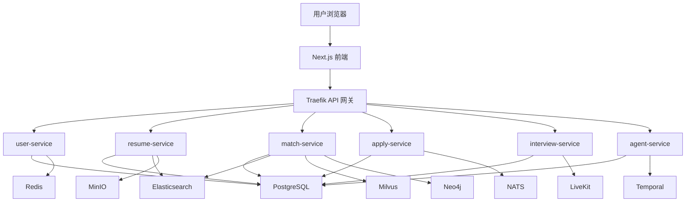

# JobPilot 项目计划书

## 一、项目概述

JobPilot 是一个 AI 驱动的求职辅助平台，面向求职者提供从简历整理、岗位搜索、岗位匹配、投递管理到 AI 面试训练的完整求职闭环。

项目目标不是单一的简历工具，而是构建一个生产级 SaaS 求职工作台，帮助用户系统化管理求职过程，提高简历质量、岗位匹配效率和面试准备质量。

## 二、项目定位

| 项目 | 内容 |
|------|------|
| 产品名称 | JobPilot |
| 产品类型 | AI 求职辅助 SaaS 平台 |
| 核心用户 | 应届生、社招候选人、转行用户、高频面试者 |
| 核心价值 | 帮助用户完成简历优化、岗位匹配、投递跟踪和面试准备 |
| 交付目标 | 可本地运行、可测试、可部署、可演示的生产级系统 |

## 三、项目目标

### 3.1 业务目标

- 帮助求职者快速整理和优化简历。
- 根据用户简历和技能自动匹配合适岗位。
- 管理投递记录和求职进度。
- 提供 AI 面试训练和反馈报告。
- 建立可持续迭代的求职数据平台。

### 3.2 技术目标

- 建立清晰的前后端分离架构。
- 支持 Docker 本地一键启动。
- 支持 CI 自动测试、构建和安全扫描。
- 支持健康检查、日志、监控和备份。
- 为后续云部署和 Kubernetes 扩展预留能力。

## 四、目标用户与使用场景

| 用户类型 | 典型痛点 | JobPilot 解决方式 |
|----------|----------|------------------|
| 应届生 | 不知道简历如何写、岗位如何筛选 | 简历评分、模板生成、岗位推荐 |
| 社招候选人 | 投递多、记录乱、跟进困难 | 投递看板、状态流转、时间线 |
| 转行用户 | 不清楚技能差距和目标路径 | 匹配分析、技能缺口、职业路径建议 |
| 高频面试者 | 面试准备低效、缺少反馈 | AI 模拟面试、报告生成、改进建议 |

## 五、核心功能规划

| 模块 | 功能 | 优先级 | 说明 |
|------|------|--------|------|
| 用户系统 | 注册、登录、JWT 鉴权 | P0 | 系统基础入口 |
| 用户资料 | 技能、经历、教育、联系方式 | P0 | 支撑简历生成与岗位匹配 |
| 简历解析 | 上传 PDF/DOCX/TXT 并提取结构化内容 | P0 | MVP 核心能力 |
| 简历评分 | ATS 评分、关键词缺失分析 | P0 | 提供即时反馈 |
| 简历生成 | 根据职位生成定制简历 | P0 | AI 核心能力 |
| 职位搜索 | 关键词、地点、远程筛选 | P0 | 求职流程入口 |
| 岗位匹配 | 简历与岗位匹配度分析 | P0 | 提升投递效率 |
| 投递管理 | 创建投递、状态流转、备注 | P0 | 完成求职闭环 |
| Dashboard | 统计简历、岗位、投递、面试数据 | P1 | 提供求职进度总览 |
| AI 面试 | 模拟问答、反馈、报告 | P1 | 增强用户训练能力 |
| 工作流 | 定时扫描、自动备份、任务编排 | P2 | 生产成熟度能力 |
| 运维能力 | 健康检查、日志、监控、备份恢复 | P1 | 上线必备 |

## 六、MVP 范围

### 6.1 MVP 必须包含

| 功能 | 验收标准 |
|------|----------|
| 注册与登录 | 用户可以注册、登录并获取访问令牌 |
| 用户资料 | 用户可以维护基本资料、技能和经历 |
| 简历上传解析 | 用户可以上传简历并看到解析结果 |
| 简历评分 | 系统可以输出 ATS 分数和优化建议 |
| 职位搜索 | 用户可以搜索和浏览职位 |
| 岗位匹配 | 系统可以返回匹配分和缺失技能 |
| 投递管理 | 用户可以创建投递并更新状态 |
| Dashboard | 用户可以看到核心统计数据 |
| Docker 启动 | 本地可以通过 Docker Compose 启动服务 |

### 6.2 MVP 暂缓功能

| 功能 | 暂缓原因 |
|------|----------|
| 视频面试 | 技术复杂，第一版可先做文字面试 |
| 多租户计费 | 商业化阶段再实现 |
| Kubernetes 生产部署 | 第一版先以 Docker Compose 和部署文档为主 |
| 复杂爬虫系统 | 涉及合规和稳定性，先使用手动或模拟职位数据 |
| 高级推荐模型 | 初期可用规则和关键词匹配替代 |

## 七、技术架构方案

| 层级 | 技术方案 | 选择原因 |
|------|----------|----------|
| 前端 | Next.js + TypeScript + Ant Design | 开发效率高，适合 SaaS 管理台 |
| 状态管理 | Zustand | 简洁轻量，适合当前规模 |
| 后端 | FastAPI | Python AI 生态好，接口开发快 |
| 数据库 | PostgreSQL | 适合核心业务数据 |
| 缓存 | Redis | 支持缓存、限流、幂等和会话辅助 |
| 搜索 | Elasticsearch | 支持职位全文搜索 |
| 向量匹配 | Milvus / 后续可替换 pgvector | 支持语义匹配能力 |
| 图数据库 | Neo4j | 支持职业路径和技能关系 |
| 文件存储 | MinIO / S3 | 存储简历、报告、模型文件 |
| 工作流 | Temporal | 支持重试、定时任务、Saga 流程 |
| 网关 | Traefik | 本地和生产均可作为 API 网关 |
| 部署 | Docker Compose + Helm | 本地简单，生产可扩展 |
| CI/CD | GitHub Actions | 自动验证、构建、安全扫描 |

## 八、系统架构



## 九、数据模型规划

| 数据表 | 说明 |
|--------|------|
| users | 用户账号与认证信息 |
| profiles | 用户资料、技能、教育和经历 |
| resumes | 简历主表 |
| resume_versions | 简历版本记录 |
| jobs | 职位数据 |
| match_results | 岗位匹配结果 |
| applications | 投递记录 |
| application_timeline | 投递状态流转历史 |
| interview_sessions | 面试会话 |
| interview_reports | 面试报告 |
| audit_logs | 用户操作审计日志 |

## 十、核心 API 规划

| 模块 | 接口 | 说明 |
|------|------|------|
| Auth | POST `/api/users/auth/register` | 用户注册 |
| Auth | POST `/api/users/auth/login` | 用户登录 |
| Profile | GET `/api/users/profile` | 获取用户资料 |
| Profile | PUT `/api/users/profile` | 更新用户资料 |
| Resume | POST `/api/resumes/parse` | 上传并解析简历 |
| Resume | POST `/api/resumes/score` | ATS 评分 |
| Resume | POST `/api/resumes/generate` | AI 生成简历 |
| Job | GET `/api/matches/jobs/search` | 搜索职位 |
| Match | POST `/api/matches/match/evaluate` | 岗位匹配分析 |
| Apply | POST `/api/applications` | 创建投递 |
| Apply | PATCH `/api/applications/{id}` | 更新投递状态 |
| Interview | POST `/api/interviews/start` | 开始面试 |
| Interview | POST `/api/interviews/{id}/answer` | 提交回答 |
| Interview | POST `/api/interviews/{id}/report` | 生成面试报告 |

## 十一、开发阶段计划

### 阶段一：MVP 原型

| 目标 | 任务 | 产出 | 验收标准 |
|------|------|------|----------|
| 跑通基础闭环 | 用户注册、登录、Profile | 用户模块 | 用户可登录进入系统 |
| 简历能力 | 上传、解析、展示 | 简历模块 | 可看到结构化简历内容 |
| 职位能力 | 职位列表和搜索 | 职位模块 | 可搜索职位 |
| 投递能力 | 创建投递、更新状态 | 投递模块 | 可管理投递进度 |
| 前端体验 | Dashboard 和导航 | 前端页面 | 用户能完成完整流程 |

### 阶段二：核心功能闭环

| 目标 | 任务 | 产出 | 验收标准 |
|------|------|------|----------|
| 简历优化 | ATS 评分、关键词建议 | 评分报告 | 输出分数和建议 |
| 岗位匹配 | 简历与岗位匹配 | 匹配接口 | 输出匹配分和缺口 |
| AI 生成 | 根据职位生成定制简历 | 生成接口 | 输出可读简历 |
| 状态管理 | 投递状态机 | 状态流转 | 非法状态转换被阻止 |

### 阶段三：AI 能力增强

| 目标 | 任务 | 产出 | 验收标准 |
|------|------|------|----------|
| AI 面试 | 问答、反馈、报告 | 面试模块 | 可完成一轮模拟面试 |
| 多模型支持 | Provider 抽象 | AI 适配层 | 模型失败可降级 |
| 职业建议 | 技能差距、学习建议 | 推荐模块 | 输出下一步建议 |

### 阶段四：质量与生产化

| 目标 | 任务 | 产出 | 验收标准 |
|------|------|------|----------|
| 测试覆盖 | 单元、集成、E2E | 测试套件 | CI 可自动运行 |
| 安全加固 | 鉴权、限流、脱敏 | 安全中间件 | 敏感信息不进日志 |
| 性能优化 | 连接池、缓存、静态构建 | 优化配置 | 接口和页面稳定 |
| 运维能力 | 健康检查、备份、监控 | 运维体系 | 可定位和恢复故障 |

### 阶段五：部署上线

| 目标 | 任务 | 产出 | 验收标准 |
|------|------|------|----------|
| 本地部署 | Docker Compose | 本地运行环境 | 一键启动 |
| 测试环境 | CI 全栈验证 | 验证报告 | 自动测试通过 |
| 生产部署 | Helm / Kubernetes / Vercel | 部署文档 | 可按文档上线 |

## 十二、测试计划

| 测试类型 | 覆盖内容 | 工具 |
|----------|----------|------|
| 单元测试 | 解析器、评分器、状态机、匹配算法 | pytest |
| 集成测试 | API、数据库、Redis、服务间调用 | pytest-asyncio |
| 前端类型检查 | TypeScript 类型安全 | tsc |
| 前端质量检查 | 代码规范、未使用变量 | ESLint |
| 构建测试 | 前端生产构建 | Next.js build |
| E2E 测试 | 注册、登录、上传简历、匹配、投递 | curl / Playwright |
| 安全扫描 | 后端风险与依赖漏洞 | Bandit / npm audit |
| 混沌测试 | Redis、数据库、服务故障 | Docker 脚本 |
| 性能测试 | 并发、响应时间、吞吐量 | k6 / Locust |

## 十三、部署方案

### 13.1 本地部署

```bash
cp .env.example .env
make setup
make up
python scripts/seed.py
```

### 13.2 测试环境部署

```bash
docker compose up -d --build
curl http://localhost/api/users/health/livez
curl http://localhost/api/resumes/health/livez
```

### 13.3 生产环境部署

推荐方式：

1. 前端部署到 Vercel。
2. 后端部署到 AWS EKS / ACK / TKE。
3. PostgreSQL 使用托管 RDS。
4. Redis 使用托管 Redis。
5. MinIO 可替换为 S3。
6. Elasticsearch 可替换为 Elastic Cloud 或 OpenSearch。
7. GitHub Actions 负责自动测试、构建和部署。

## 十四、运维与保障

| 能力 | 说明 |
|------|------|
| 健康检查 | 每个服务提供 livez / readyz |
| 优雅关闭 | 服务收到关闭信号后等待请求完成 |
| 幂等性 | 关键写入接口支持 Idempotency-Key |
| 日志 | 结构化日志和敏感信息脱敏 |
| 监控 | Prometheus 指标和 Jaeger 链路追踪 |
| 备份 | PostgreSQL、Redis、ES、MinIO 定期备份 |
| 恢复 | 提供 restore 脚本和运维手册 |

## 十五、项目风险与边界

| 风险 | 说明 | 应对方案 |
|------|------|----------|
| AI 模型不可用 | 外部模型 API 可能失败或限流 | 设计规则降级和多 Provider |
| 简历数据敏感 | 简历包含个人隐私 | 权限控制、日志脱敏、文件隔离 |
| 职位数据合规 | 爬取岗位可能违反网站规则 | 优先使用合法 API 或用户导入 |
| 微服务复杂度 | 早期拆分过细会增加维护成本 | MVP 阶段控制服务边界 |
| 部署成本 | ES、Milvus、Neo4j 等资源占用较高 | MVP 可先用轻量替代方案 |

## 十六、第一周执行计划

| 日期 | 任务 | 产出 |
|------|------|------|
| Day 1 | 初始化项目结构、Docker Compose、数据库连接 | 项目可启动 |
| Day 2 | 实现用户注册、登录、JWT 鉴权 | 用户系统可用 |
| Day 3 | 实现 Profile 数据模型和接口 | 用户资料可保存 |
| Day 4 | 实现简历上传和文本解析 | 简历解析可用 |
| Day 5 | 实现职位数据表和搜索接口 | 职位列表可搜索 |
| Day 6 | 实现投递记录和状态管理 | 投递闭环可用 |
| Day 7 | 前端接入登录、Dashboard、简历、职位、投递页面 | MVP 可演示 |

## 十七、阶段性交付物

| 阶段 | 交付物 |
|------|--------|
| MVP | 可登录、可上传简历、可搜索职位、可创建投递 |
| 核心闭环 | ATS 评分、匹配分析、AI 简历生成 |
| AI 增强 | AI 面试、报告、职业建议 |
| 生产化 | CI/CD、健康检查、监控、备份、文档 |
| 最终交付 | 源码、部署文档、测试报告、运维手册、交付清单 |

## 十八、验收标准

项目达到以下条件即可视为第一版可交付：

- 用户可以完成注册、登录和资料维护。
- 用户可以上传简历并查看解析结果。
- 系统可以对简历进行评分。
- 用户可以搜索职位并查看匹配结果。
- 用户可以创建和管理投递记录。
- 前端页面具备 loading、error、empty 状态。
- 后端接口具备认证、异常处理和基础日志。
- Docker Compose 可以启动完整环境。
- CI 可以完成类型检查、构建和测试。
- 文档包含开发、部署、运维和测试说明。

